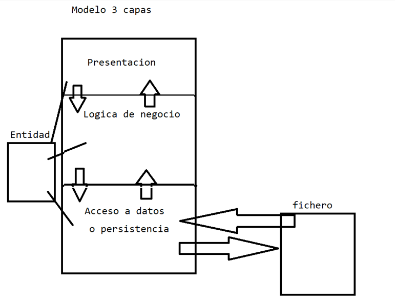
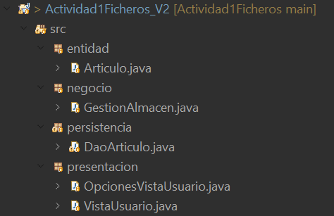
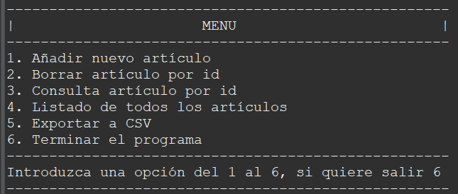
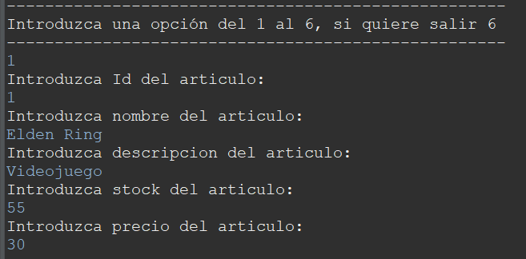
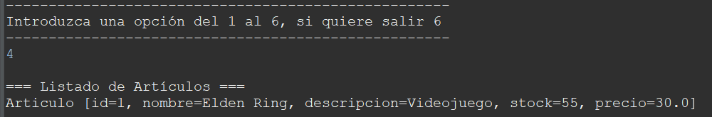
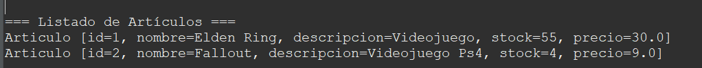
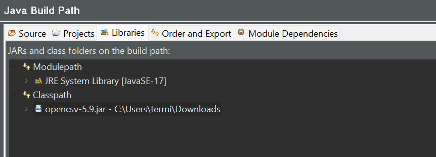
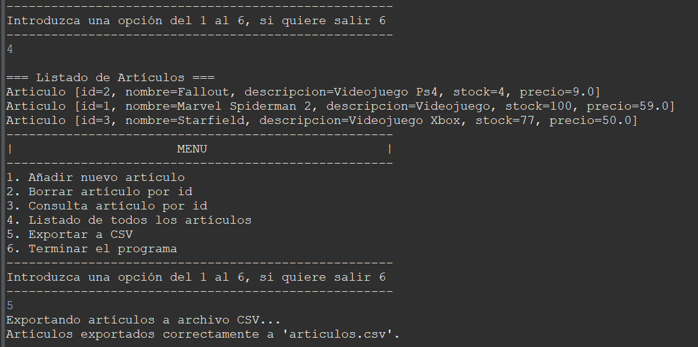
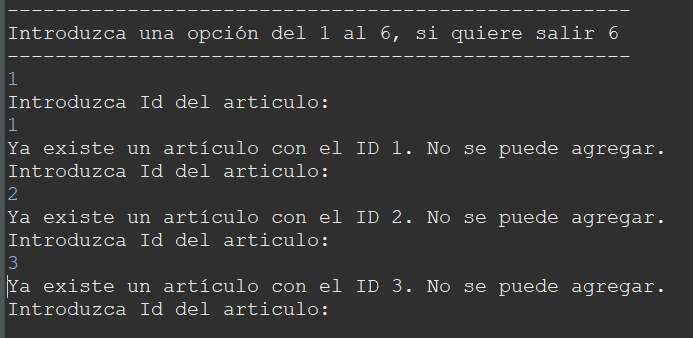

# Actividad1Ficheros
## Actividad 1  – Manejo de ficheros. Acceso a datos

Realizada por:
Alberto Arroyo Santofimia

Objetivos

Aprender a trabajar de manera práctica los ficheros mediante una pequeña aplicación de gestión de un almacén.

Pautas de elaboración

La actividad la he realizado según la ultima clase, siguiendo el modelo de 3 capas.

En la **entidad** tengo el JavaBean Articulo, que siguiendo el convenio tiene los atributos privados, el constructor por defecto y los getters/setters públicos.

En la **capa de presentación**, la clase VistaUsuario, tengo la capa visual de la aplicación, que consta de un menú para que el usuario final interactúe con el y llamará a los métodos que tengo en la lógica de negocio.

En la capa de **lógica de negocio**, la clase GestionAlmacen, están los métodos que han sido llamados en la capa de presentación, hay métodos de validación de datos y otros métodos se comunican con la capa de acceso a datos o persistencia, para añadir, borrar, consultar, etc.

En la capa de **acceso a datos o persistencia**, la clase DaoArticulo, es donde se guardan los datos, tiene un método para crear el archivo .dat en caso de que no exista y si existe tiene un metido que se encargará de introducir los datos del .dat al ArrayList nada más arrancar el programa. A parte tiene los métodos que se encargan de guardar, borrar, consultar los datos del ArrayList de artículos y exportar a CSV.

### Requerimiento 1

Esta práctica consiste en la implementación de un programa Java para la gestión del almacén de artículos. Los artículos tendrán los siguientes atributos, id, nombre, descripción, stock (o cantidad) y precio.

El usuario interactuará con el programa a través del siguiente menú, que servirá como interfaz.

Añadir nuevo artículo
Borrar artículo por id
Consulta artículo por id
Listado de todos los artículos
Terminar el programa
Nada más comenzar la ejecución del programa se debe verificar si existe el fichero artículos.dat (fichero que contendrá objetos ‘Articulo’). Si existe, debes leerlo para llenar una colección de tipo ArrayList con todos los objetos ‘Articulo’ existentes en el fichero. Si no existe el archivo, no tendrás nada que hacer por el momento, pero sí debes dejar la colección ArrayList disponible, aunque esté vacía.

Las opciones del menú 1 a 5 trabajarán sobre la colección de tipo ArrayList para añadir, borrar, consultar o listar, y no sobre el fichero artículos.dat.

Cuando el usuario decida terminar la ejecución del programa pulsando la opción 5, el programa deberá crear el fichero artículos.dat, sobrescribiendo el anterior si existiera. Se escribirán en el fichero tantos artículos como elementos tenga la colección ArrayList que has creado.

### Requerimiento 2

Se añadirá una opción al menú que será “Exportar artículos a archivo CSV”, que creará un fichero (artículos.csv) donde guardará la información de los artículos con el formato de un archivo CSV. Se debe comprobar que dicho fichero se puede abrir con un programa como Excel o alguna herramienta en online en la memoria de la actividad. Se podrá utilizar alguna biblioteca de java para hacer esta funcionalidad.

Descargo la biblioteca para utilizar Opencsv y añado el archivo jar al proyecto

### Requerimiento 3

No se permite duplicar el id del artículo.

